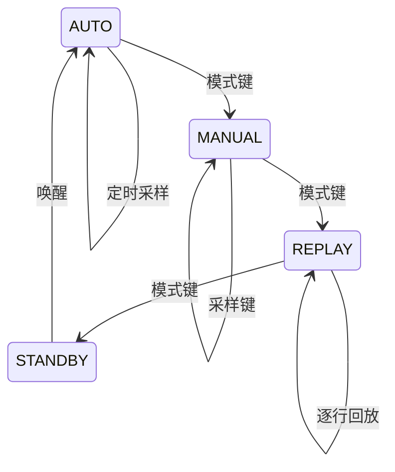

# 实训 6：状态机整合

## 先画状态，再写转移

四个状态对应已完成的四种模式，不重写内部功能。`Workstation` 保存当前状态、参数和运行标志；事件由按键、定时器、UART 或错误模块产生。代码见 `workstation.*` 与 `Examples/lab6.c`。

每种模式有三个阶段：进入时配置一次、运行时处理事件、离开时释放资源。参考代码用 `entry_pending` 表示进入动作。真实整合时：AUTO 进入启动 TIM2；离开停止 TIM2；REPLAY 进入打开文件；STANDBY 进入前同步文件并停止外设。

## 调试状态迁移

每次迁移打印 `STATE AUTO -> MANUAL`。在 CubeIDE 给 `workstation_dispatch` 下断点，观察 `event`、`mode`、`running`。若系统卡住，用暂停按钮看当前调用栈，不要只反复复位。

看门狗只在主循环完成一轮状态处理后刷新。任何模式都不能长时间阻塞；回放和 SD 写入要拆成小步。

> 🤖 **AI Check**：状态机相比大量 if-else 有什么好处？什么是进入动作、退出动作和守卫条件？

> ⚠️ **踩坑实验**：临时删掉 `REPLAY_DONE` 的处理，执行回放并观察 `running` 为什么不会清零；利用日志和断点定位后恢复代码。

> 🖼️ **[配图：四状态状态机；事件来源与状态机关系图]**

> 🔁 **复盘**：整合时哪些模块争用了定时器、UART 或 SD 卡？若增加“校准模式”，需要新增哪些状态、事件和资源进入/退出动作？
