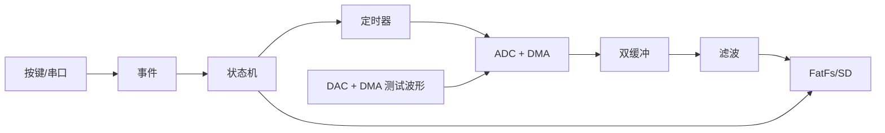

# 实训 8：完整系统集成与优化

## 总体结构

集成顺序是：先保持实训 6 的阻塞式采集能工作，再引入 ADC DMA 双缓冲，最后加入 DAC 闭环测试。一次只换一个环节，否则出现问题时无法判断来源。

## DMA 与缓冲

DMA 负责在 ADC/内存和 DAC/内存之间搬数据。回调只把“半缓冲/全缓冲就绪”标志放入队列，主循环完成滤波与 SD 写入。若生产速度大于消费速度，必须记录 overrun，而不是悄悄覆盖旧数据。

`Examples/lab8.c` 给出 32 点 12 位测试波形。TIM6 TRGO 触发 DAC，示波器 CH1 看 DAC 输出、CH2 看对应测试点或调试 GPIO；ADC 采回后画出原始和滤波波形。幅值超出 0–VDDA 会失真，DAC 到 ADC 之间可按实际板卡加入限流/缓冲。

## 资源表

| 资源 | 所属模块 | 约束 |
|---|---|---|
| TIM2 | ADC 采样节拍 | 状态切换时启停 |
| TIM6 | DAC 波形节拍 | 不与 HAL tick 冲突 |
| DMA | ADC/DAC/SPI | 核对 stream/channel 与优先级 |
| SPI1 | SD | 同总线设备需独立 CS |
| USART1 | 日志与协议 | 日志不能破坏二进制协议，产品版应分流 |

## IDE 在线定位

监视 DMA 写指针、消费指针、overrun 计数和状态。断点会暂停 CPU，但外设/DMA 是否暂停取决于调试冻结配置；涉及实时波形时优先用计数器和 GPIO 脉冲观察，少用长时间断点。

> 🤖 **AI Check**：DMA 相比 CPU 搬运的核心优势是什么？为什么用了 DMA 仍然可能丢数据？

> ⚠️ **踩坑实验**：故意让 ADC 与另一个外设选同一 DMA stream，或把 SD 写入改成超长阻塞，观察 CubeMX 冲突提示或 overrun 计数变化，再恢复资源表。

> 🖼️ **[配图：系统总体架构；DMA 双缓冲；DAC 输出与 ADC 采回波形对比]**

> 🔁 **复盘**：本次集成 bug 是哪个模块对另一个模块做了什么隐藏假设？资源表能否在写代码前暴露它？
